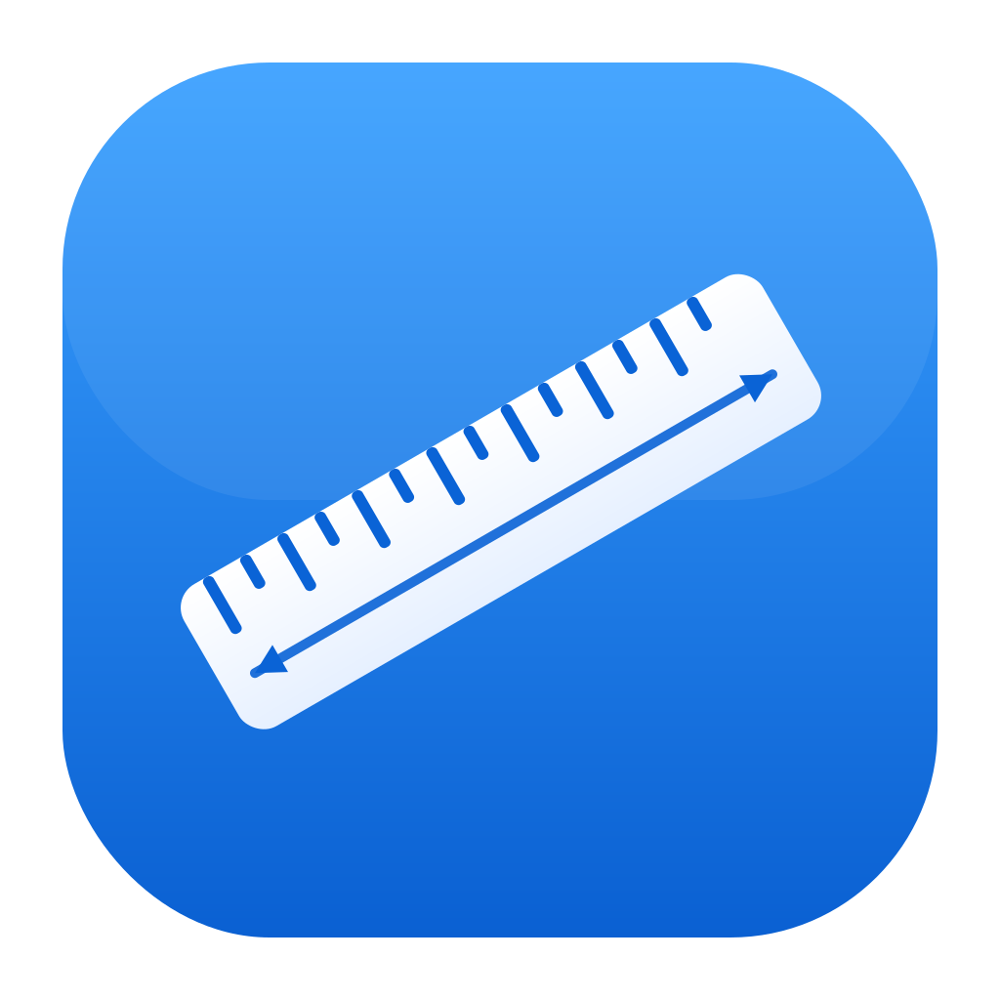
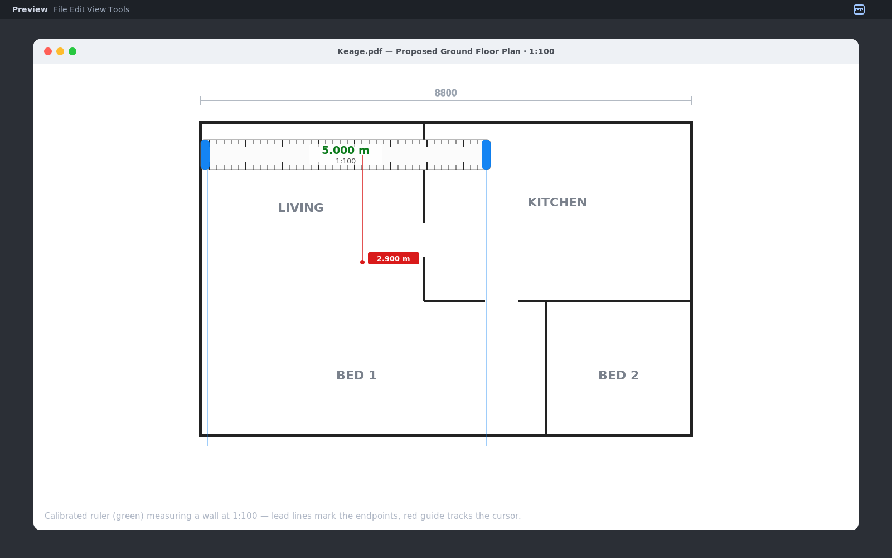
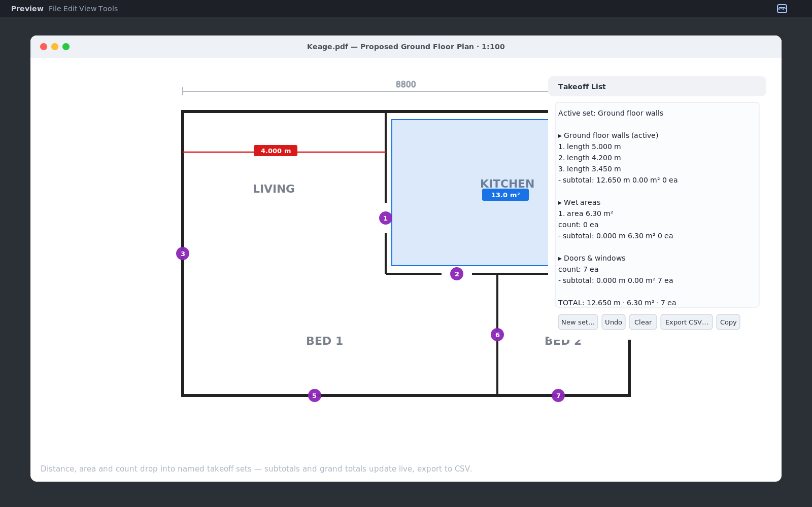

<p align="center">
  
</p>

<h1 align="center">Desktop Scale Ruler</h1>

A floating, always-on-top screen ruler for **macOS and Windows** — in the spirit of [Free Ruler](https://github.com/pascalpp/FreeRuler) — but it reads out **real-world dimensions** so you can measure on-screen PDF plans at scale, and build a running **takeoff** as you go.

Built for the people who mark up drawings in Preview rather than open a CAD package: builders, estimators, draftees, renovators, and students.

**New here? See the [Quick Start guide](QUICKSTART.md).**

### Measuring a wall at scale


### Distance, area & count feeding a named-set takeoff


> The images above are illustrative mockups of the interface, not live captures.

## What it does

- Floats over any window (Preview, a browser, anything) and stays on top.
- Reads measurements in **real-world mm / m**, not pixels.
- **Calibrate to a known dimension** on the plan, or use **1:100 / 1:50 / custom** presets.
- Presets are tied to your display's real physical size, so they're accurate at Preview's **Actual Size**.
- **Distance mode** — click two points anywhere for straight-line length + angle.
- **Area mode** — click a polygon around a room or zone for live m².
- **Count mode** — click to drop numbered markers and tally items (doors, windows, posts, downlights).
- **Takeoff list** — every distance, area and count drops into a named **set** (e.g. "Footings", "Ground floor walls"). The Takeoff window groups items by set with per-set subtotals (lineal m, m², count) plus grand totals, and exports to **CSV** for Excel/Jack. Persists between launches.
- **Lead lines** extend from each end so you can line up dimensions precisely.
- **Live cursor guide** shows the running distance from the ruler's start to your pointer.
- **Minimise** into a small floating pill that stays on top.
- Quick access from a **menu-bar icon** and a control panel.
- Settings (scale, units, position, calibration) **persist between launches**.

## Install

### Download (easiest)

1. Grab the latest `DesktopScaleRuler.zip` from the [Releases](../../releases) page and unzip it.
2. Move `DesktopScaleRuler.app` to your Applications folder.
3. The app isn't code-signed, so the first time, **right-click it → Open → Open** to get past Gatekeeper. After that it opens normally.

### Build from source

You need Apple's Swift compiler (ships with the Xcode Command Line Tools):

```bash
xcode-select --install     # once, if you've never installed the dev tools
git clone https://github.com/thomasljones96/Desktop-scale-ruler.git
cd Desktop-scale-ruler
chmod +x build.sh
./build.sh
open DesktopScaleRuler.app
```

## Using it

The ruler floats on screen with a small control panel and a menu-bar icon.

- **Move**: drag the middle. **Resize**: drag a blue end-handle.
- **Rotate** horizontal/vertical, toggle **mm / m**, and switch **modes** from the control panel, the menu bar, or keyboard shortcuts.
- **Minimise**: double-click the ruler (or ⌘M). Double-click the pill to expand.

### Setting the scale

**Calibrate (most reliable, works at any zoom):** stretch the ruler across a dimension you already know on the plan, click *Calibrate to known dimension*, and type its real length in mm. The readout turns **green** to show it's calibrated.

**Presets (1:100 / 1:50 / custom):** these assume the PDF is shown at Preview's **Actual Size**. For them to be exact, run **Calibrate Display (once)** — hold a real ruler or a credit card (85.6 mm wide) to the screen, stretch the on-screen ruler to match, and enter the physical length. This stores your display's true points-per-mm so presets are spot-on from then on.

### Keyboard shortcuts

| Action | Shortcut |
|---|---|
| Ruler mode | ⌘B |
| Distance mode (2 points) | ⌘D |
| Area mode | ⌘E |
| Calibrate to known dimension | ⌘K |
| Calibrate display | ⌘⇧K |
| Scale 1:100 / 1:50 | ⌘1 / ⌘2 |
| Custom scale | ⌘0 |
| Copy measurement | ⌘C |
| Rotate | ⌘R |
| Toggle mm / m | ⌘U |
| Cursor guide / Lead lines | ⌘G / ⌘L |
| Minimise | ⌘M |
| Quit | ⌘Q |

In Distance/Area modes the app captures your clicks across the whole screen, so you can't scroll the PDF underneath while measuring — press **Esc** to clear, or **⌘B** to return to the ruler. In Area mode, **double-click or Enter** closes the polygon.

## How scale works

The ruler measures a span in screen points and multiplies by a single factor (mm per point) to get real-world millimetres. Calibration sets that factor directly from a dimension you know, so it's correct at any zoom. The presets compute the factor from your display's physical geometry, which is exact at Actual Size (and dead-on after a one-time display calibration).

A free-floating ruler can't detect your PDF viewer's zoom, so if you change zoom, re-calibrate.

## Windows version

A native Windows build (C# / WPF) lives in [`windows/`](windows/) with its own README. It mirrors the Mac features — scaled ruler, calibration, distance and area modes, tray menu, persistence — and the release workflow publishes a `DesktopScaleRuler-Windows.zip` alongside the Mac build on each tagged release.

## Credits

Inspired by [Free Ruler](https://github.com/pascalpp/FreeRuler) by Pascal Pixel. This is an independent implementation written from scratch in Swift/AppKit, with scaled-measurement features for plan work.

## License

MIT — see [LICENSE](LICENSE).
